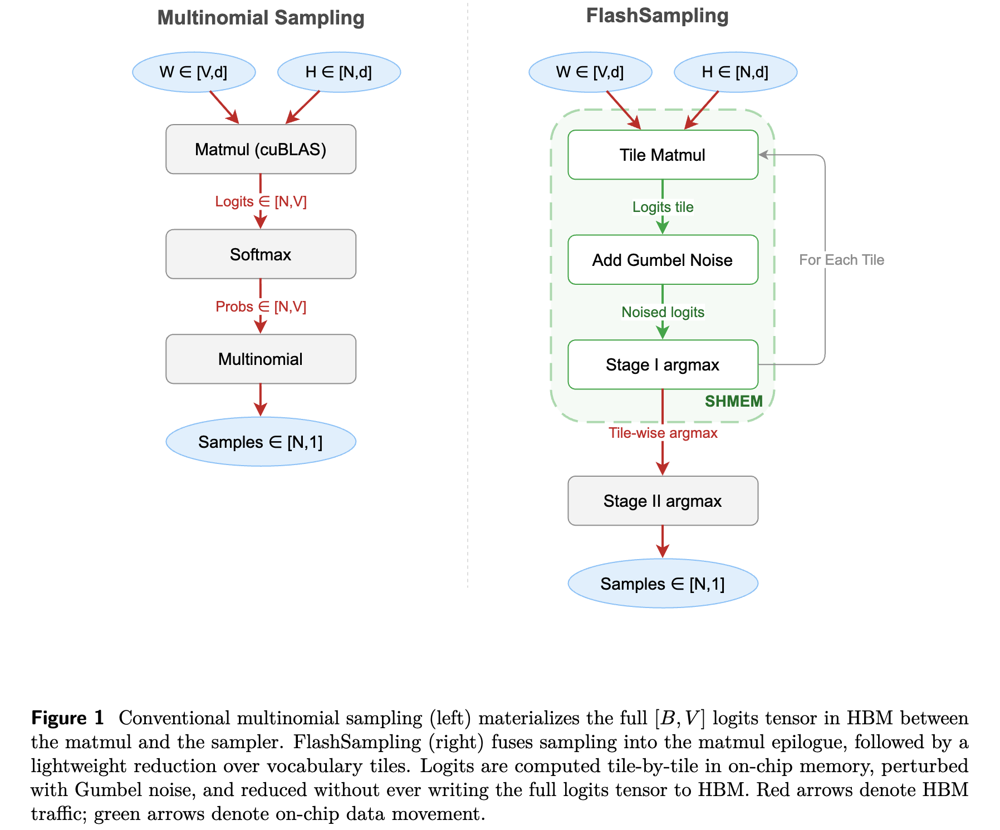

# FlashSampling

### FlashSampling: Fast and Memory-Efficient Exact Sampling 

**Paper:** [flashsampling.github.io/FlashSampling/FlashSampling.pdf](https://flashsampling.github.io/FlashSampling/FlashSampling.pdf) 

**Project Page:** [FlashSampling/FlashSampling](https://github.com/FlashSampling/FlashSampling) 

**Author:** Tomas Ruiz\*, Zhen Qin\*, [Yifan Zhang†](https://yfz.ai), Xuyang Shen, Yiran Zhong, Mengdi Wang†

**Date:** February 28, 2026

 

## Citation

```bibtex
@article{tomas2026flashsampling,
  title = {FlashSampling: Fast and Memory-Efficient Exact Sampling},
  author = {Ruiz, Tomas and Qin, Zhen and Zhang, Yifan and Shen, Xuyang and Zhong, Yiran and Wang, Mengdi},
  journal = {flashsampling.github.io},
  year = {2026},
  month = {March},
  url = "https://github.com/flashsampling/flashsampling"
}
```
